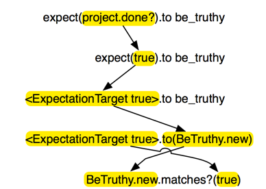

####Requirements

- Forecasting a project's progress
- Given a **project** + set of **tasks**
- Use **rate** of task_was_completed to estimate

####Where To Start?

- Start anywhere.
- Specify initialization state of the objects under test.
- Another is the **happy path**
- After First Test, We go to Second Test with purpose "Make the First Test fails" 

###My Plan...

- A new project have no tasks is done
- A new project have one or some tasks is not done
- A new task is not completed
- A new task be able mark_completed

- A project calculate total_size from total size of tasks
- A project calculate remaining_size from total size of in_complete tasks
- Estimate date from tasks finished in the last three weeks
    1) task deal with date (3 weeks)

####Integrate Rails BDD
- A user can create a project with initial tasks
- A user can enter a task, associate it with a project, and see it on the project page.
- A user can change a task's state to mark it as done
-  A project can display its progress and status using the date projection we created in the last chapter.


- RSpec call **match?** if expect...to && **does_not_match** if expect...not_to




#### RSpec Predefined Matchers

- Document link:  https://relishapp.com/rspec/rspec-expectations/v/3-0/docs/built-in-matchers

```
expect(array).to all(matcher)
expect(actual).to be_truthy
expect(actual).to be_falsy
expect(actual).to be_nil
expect(actual).to be_between(min, max)
expect(actual).to be_within(delta).of(actual)
expect {block}.to change(receiver, message, &block)
expect(actual).to contain_exactly(expected)
expect(actual).to eq(actual)
expect(actual).to have_attributes(key/value pairs)
expect(actual).to include(*expected)
expect(actual).to match(regex)
expect( {block}.to raise_error(Exception)
expect(actual).to satisfy {block}
```


