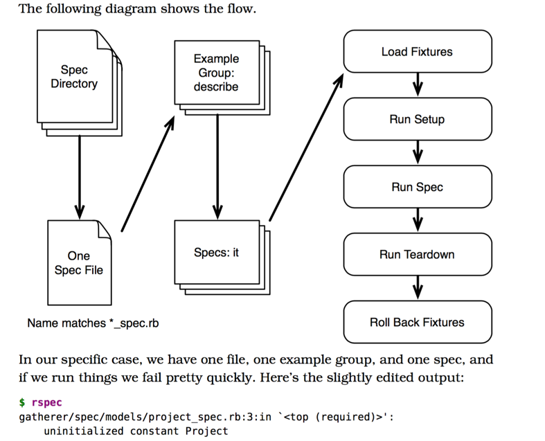

###**RSpec**

- RSpec is testing tool designed to support BDD rather than ->  RSpec use "_expect_" and "_describe_" suitable more than  "_test_" and "_assert_" in UnitTest.



####**let(:me) let!(:you) syntax**

######Always use _let_ to separate definition. 

```ruby
    # The same ideal except let defined with block
    let(:me) { User.new(name: "Lucas") } 
    expect(me.name).eq "Lucas"
    
    def me
      @me ||= User.new(name: "Lucas")
    end
    expect(me.name).eq "Lucas"
```

- Block after let isn't executed unless it's invoked
- Will not spend time to creating unused objects

```ruby
    describe "user behavior" do
      let(:me){ User.new(name: "Me") }
      let!(:you){ User.new(name: "You") }
      # false cause "me" still not evaluated
      # "let!(:you)" is invoked immediately count = 1
      specify { User.count.should == 2}
    end
```

####**Tricky**

```ruby
    def done? 
      task.empty? 
    end
    
    expect(project.done?).to be_truthy #absolutely right
    expect(project).to be_done #some magic, 1-done? -> be_done ... ahihi
```

####**Stub**

- Stub is a fake the call method that return a specified result.

####**Mock**

- Mock is a stub with an expectations that the method gets called.

```ruby
def slice(*args)
  return nil
end
```

**Best Practice**


 

