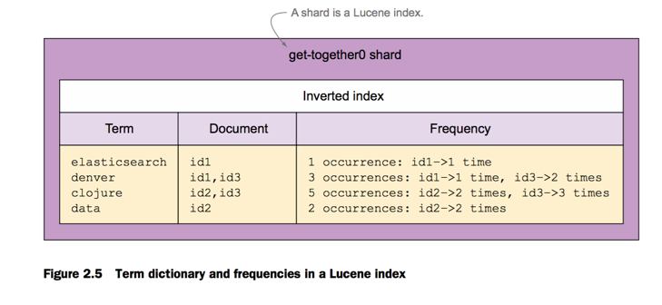

###**_Elasticsearch_**

**1 - Capabilities in Ealasticsearch**

- Suggest relevant words, avoid typo, the best suggestion at very first time
- Full-text searches and real-time statistic
- scalable by default.

**2 - Adapt with**

- Top relational database to create indices
- Can index data in NoSQL to add search capabilities
(Cause data is represented in Elasticsearch as documents(JSON))

**Apache Lucene index data by default**

- Apache Lucene does it with **inverted indexing**

**Relational DB**

| PostID | Tags |
| --- | ---|
| 1 | red   |
| 2 | red green |
| 3 | red green blue |

**Inverted Indexing Data**

| Tags | Post IDs |
| --- | ---|
| red   | 1,2,3   |
| green | 2,3 |
| blue  | 3 |

**Real world**

| Tags | Post IDs |
| --- | ---|
| Ruby  | 100 ids   |
| on    | 1000000 ids |
| Rails | 200 ids |

- And yah, "Ruby" and 100ids include "Ruby", it's sound good aboud speed of query and

```in this case Tags "Ruby", "Rails" is more relevancy```

- And you know that "No free lunch", you have to tradeoff

```faster + relevant = disk_space + slower_when_add_new_for_index```



#####**How do you know which "Ruby" book is relevant more than thousands ones**

- Yes, that's right?, score it to evaluate with TF-IDF algorithm

- _**TF**_ (Term Frequency): appear more times in a document("Ruby" "Rails" = 300) except "On" cause it's an normal word.
- _**IDF**_ (Inverse Document Frequency): "Ruby On Rails" appear together

_Insert your own algorithms, search on title first..._
- _**Fuzzy**_ query to match "_bicycel_" with "_bicycle_" 
- _**Analysis**_ match "_bicyclist_" or "_cycling_" to "_bicycle_". highlight matched term in **bold** (appendix C)
- _**Aggregations**_ (collect data): depend on like, share, visit times your blog to make priority...
- _**Providing suggestions**_: suggest popular searches and results, predict the term they want (appendix F about suggesters, faster queries for autocomplete...)

###_**Typical use cases**_

- Anyway Elasticsearch still a backend, a primary backend to search so you still need **1-feed data** and **2-searching on that data**".
- Adding Elasticsearch to an existing system.
- Using Elasticsearch with existing tools.

#####_**Using Elasticsearch  as the primary back end**_

- Tradeoff: As other NoSQL data stores, Elasticsearch doesn't support transaction. 
```WebApplication -> Insert/Update Elasticsearch```.

#####_**Adding Elasticsearch to an existing system**_
- So Adding another relational database as the "source of truth" is a good practice.
```WebApplication -> Insert/Update MySQL -> Sync Elasticsearch.```

#####_**Using Elasticsearch with existing tools**_

- **Large-scale logging**: Rsyslog, Logstash, Apache Flume, Kibana.


 


 


